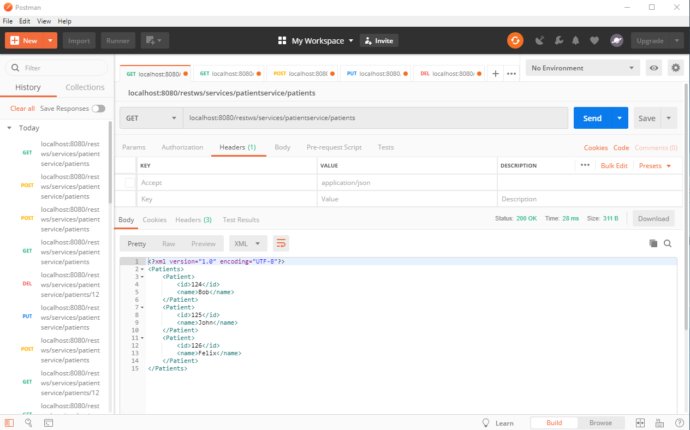
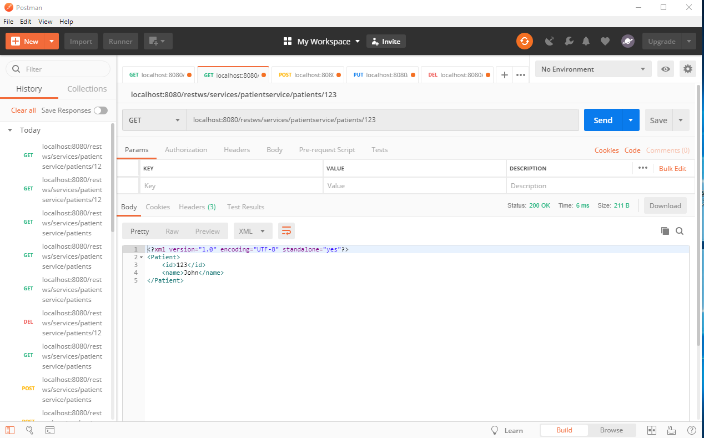
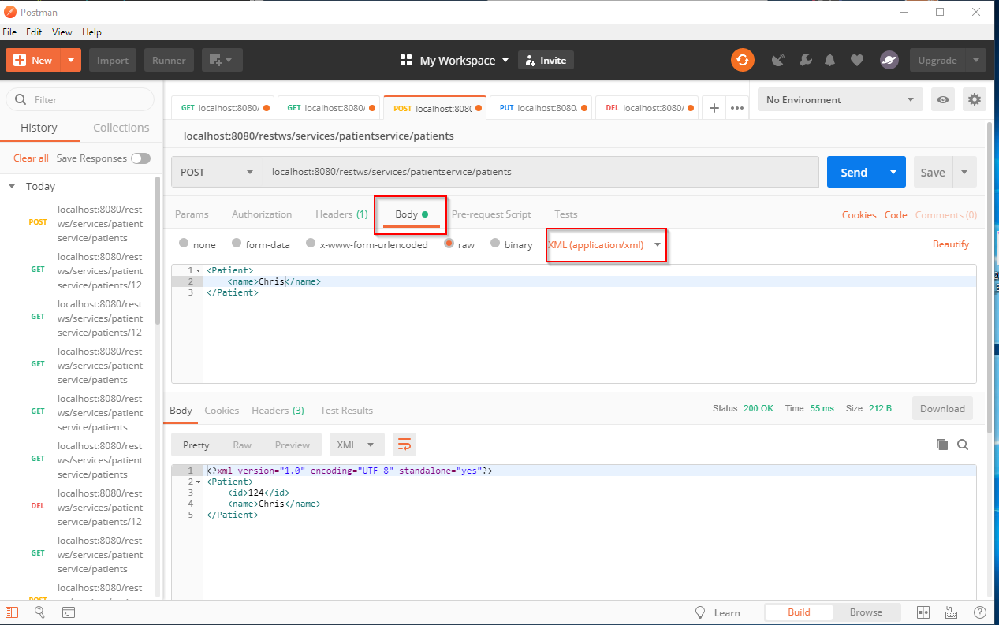
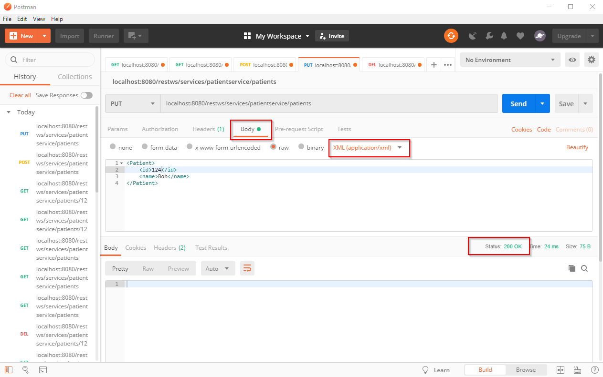
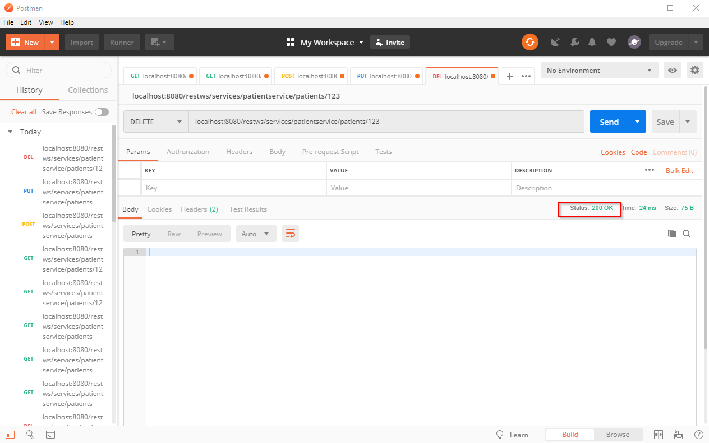
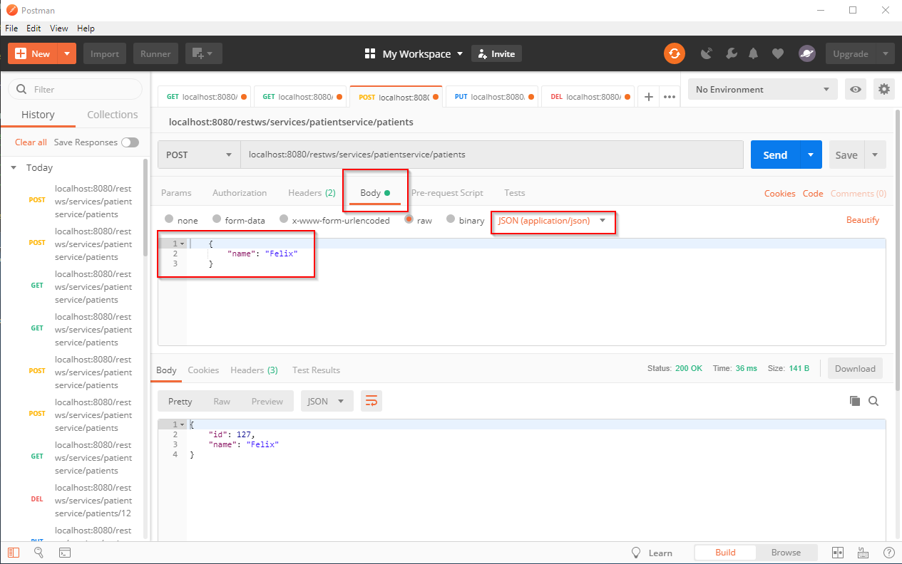
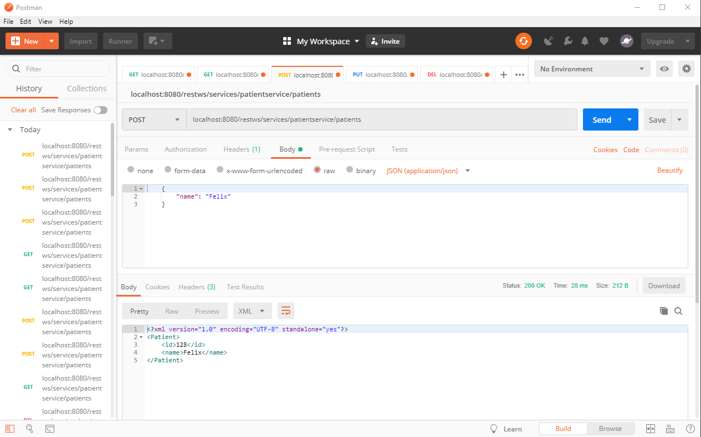
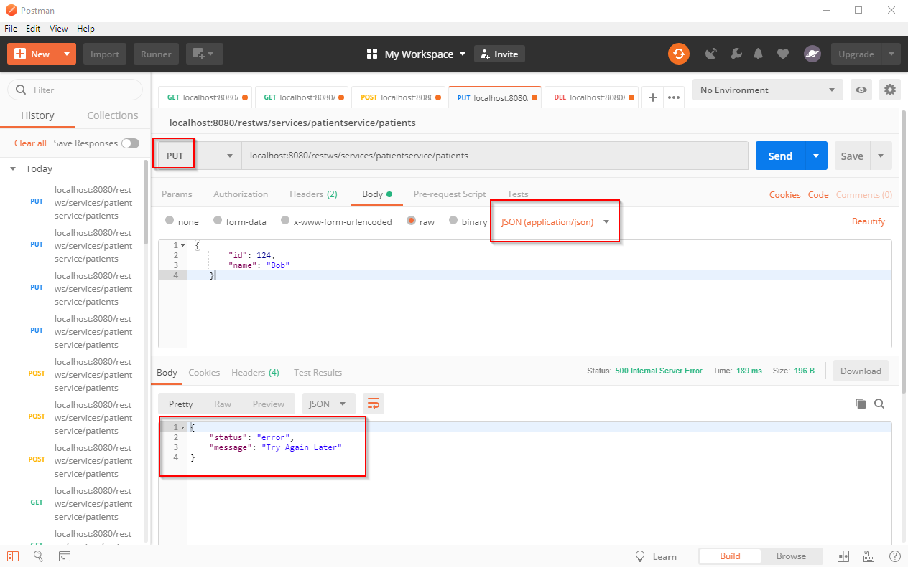

# Rest-WebService Screenshots
##  - Spring Boot, Apache-CXF, Postman - 
Basic REST Webservice for a hospital to Create, Read, Update and Delete patients

## Test of GET, POST, PUT und DELETE in Postman with XML dataformat

### GET

### POST
Make sure to have dataformat set to "application/XML" in the "Body"-Tab

### PUT
Make sure to have dataformat set to "application/XML" in the "Body"-Tab

### DELETE

## Test with JSON dataformat

### GET
Make sure to add the Key "Accept" with value "application/json" in the "Headers"-Tab

### POST
Make sure to add the Key "Accept" with value "application/json" in the "Headers"-Tab
AND set the dataformat to "application/json" in the "Body"-Tab

  

If you don't set the Key "Accept" with value "application/json" you will send json and get
XML in return ;-)

  

## Errorhandling

### Custom error message

